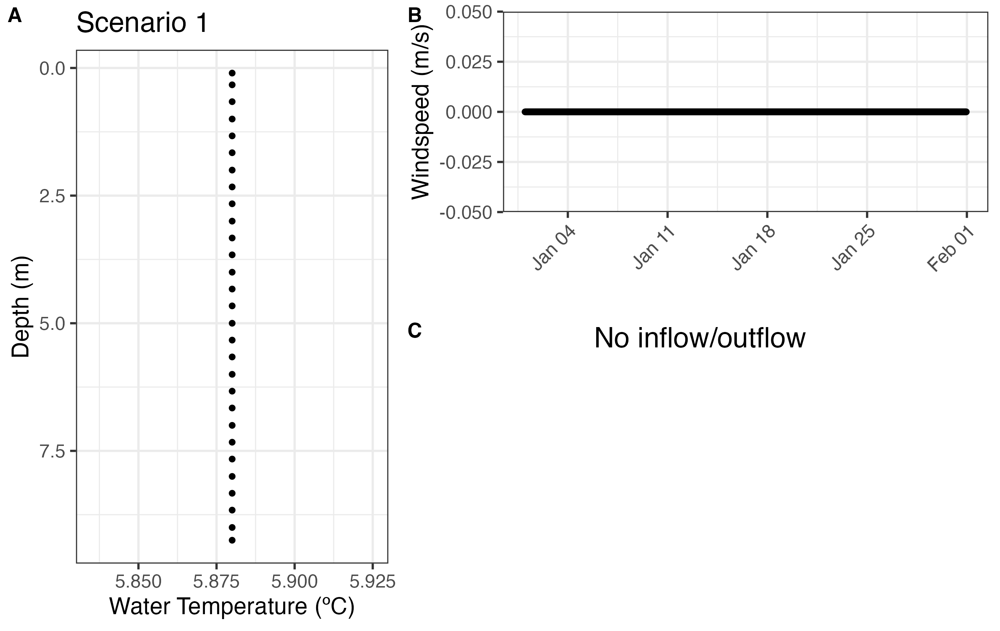

# ptm-examples
Simplified model driver data and namelist files to test a General Lake Model particle tracking model, using Falling Creek Reservoir data.

### Model scenarios (all with AED off):
1. **1_unstratified**: a one-month run in January 2016, with a homogeneous temperature profile as the initial condition, and no wind or inflows/outflows.  Designed to test vertical diffusion.
2. **2_stratified**: a one-month run in July-August 2015, with a stratified temperature profile as the initial condition, and no wind or inflows/outflows. Designed to test diffusion in a stratified water column.
3. **3_unstratified_wind**: a one-month run in January 2016, with a homogeneous temperature profile and artificial wind (six days no wind, then 1 day of wind, where each windy day is of increasing strength); no inflows/outflows.  Designed to test the movement of particles through mixing.
4. **4_stratified_wind**: a one-month run in July-August 2015, with a stratified temperature profile and artificial wind (six days no wind, then 1 day of wind, where each windy day is of increasing strength); no inflows/outflows. Designed to test the movement of particles through mixing.
5. **5_unstratified_inflow**: a one-month run in January 2016, with a homogeneous temperature profile and no wind, and one inflow/outflow of constant flow (cms). Designed the insertion of particles by an inflow.
6. **6_stratified_inflow**: a one-month run in July-August 2015, with a stratified temperature profile and no wind, and one inflow/outflow of constant flow (cms). Designed the insertion of particles by an inflow.
7. **7_unstratified_observed_wind_inflow**: a one-month run in January 2016, with a homogeneous temperature profile and observed wind and inflow data (from the primary inflow only); outflow data are set to match inflow data to maintain the reservoir at full pond. 
8. **8_stratified_observed_wind_inflow**: a one-month run in July-August 2015, with a stratified temperature profile and observed wind and inflow data (from the primary inflow only); outflow data are set to match inflow data to maintain the reservoir at full pond

### Steps to run GLM using ptm-examples (right now for Mac OS only):

1. Download VSCode [here](https://code.visualstudio.com/). 

2. Clone latest version of GLM-AED; see instructions [here](https://github.com/AquaticEcoDynamics/GLM?tab=readme-ov-file). 

3. Install homebrew if you haven't; see instructions [here](https://brew.sh/). 

4. Make sure you have the following libraries: gcc (fortran compiler); gd (graphics library); netcdf (to handle output); these can be installed with the command:
```
brew install LIBRARY_NAME
```

5. Compile GLM. To do this you will need to navigate to the glm-source folder and build GLM:
```
cd glm-aed/glm-source
./build_glm.sh
```

6. Then run GLM. You will need to point to both the folder where you have the .nml and driver files for your example as well as the folder containing the GLM executable you wish to run.

Navigate to directory that houses the model scenario you wish to run (be sure to check the filepath is correct for your directory):
```
cd ptm-examples/1_unstratified
```
Run the GLM executable (be sure to check the filepath is correct for your executable):
```
/Users/YOUR_NAME/glm-aed/glm-source/GLM/glm
```

7. If you edit the source code or download a new version of GLM, you need will to re-compile the model (Step 5) again before running it (Step 6)

### Plot output:
Plots of the initial conditions and driver data for each scenario can be found in the `plots` folder, under the sub-folder for each scenario. An example `IC_driver.png` plot for Scenario 1 (**1_unstratified**) is shown below:


